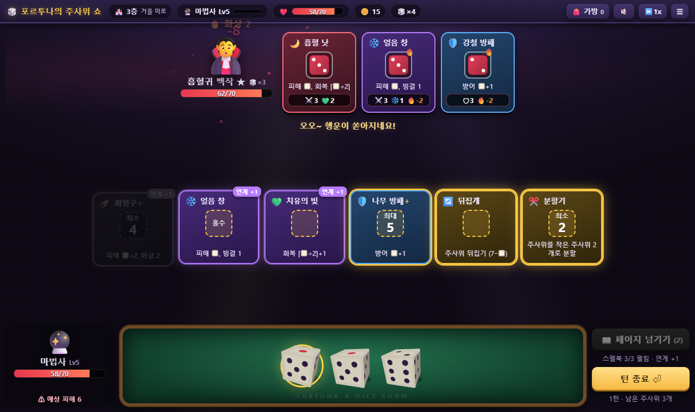
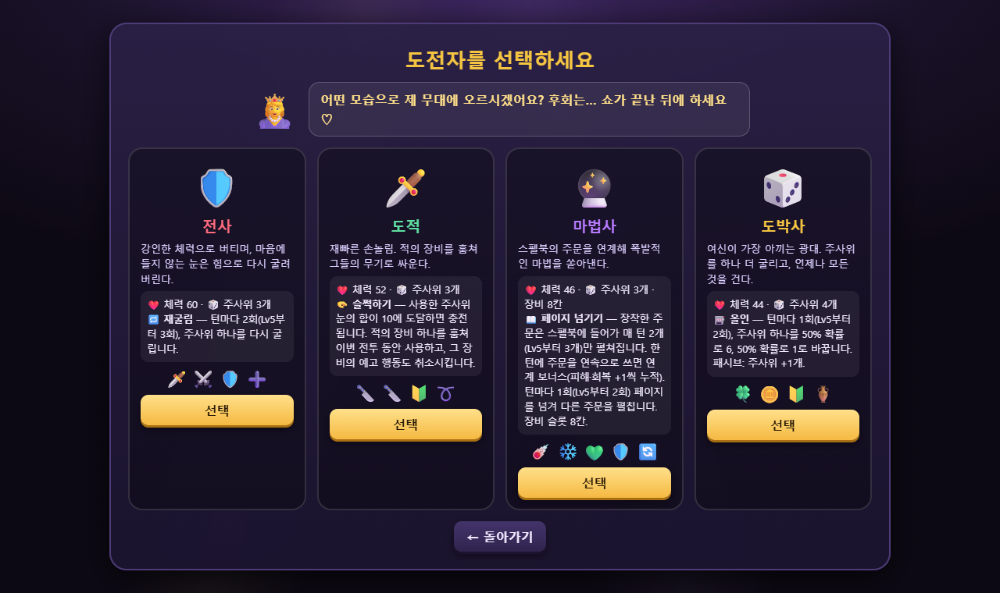
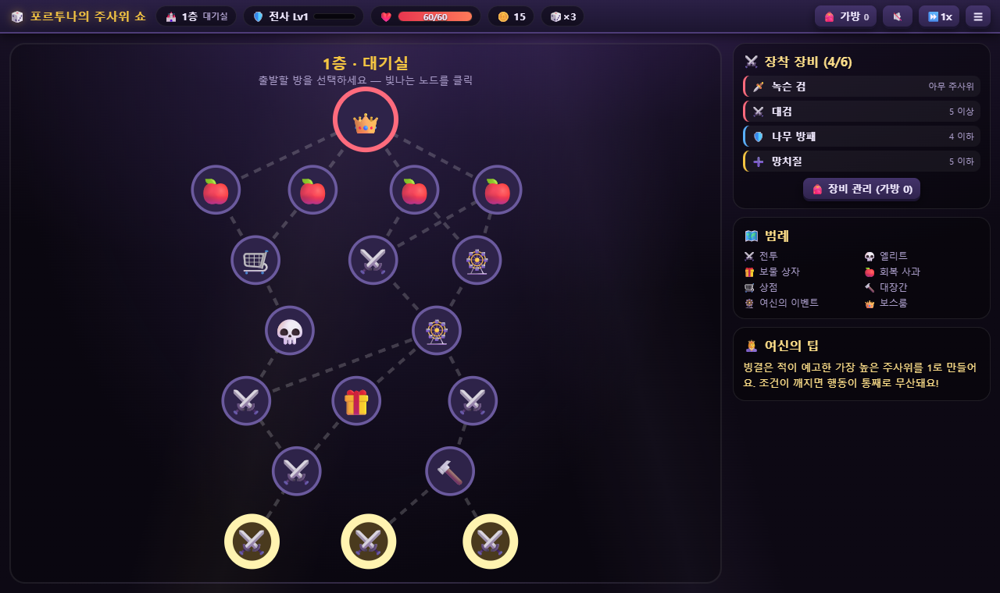
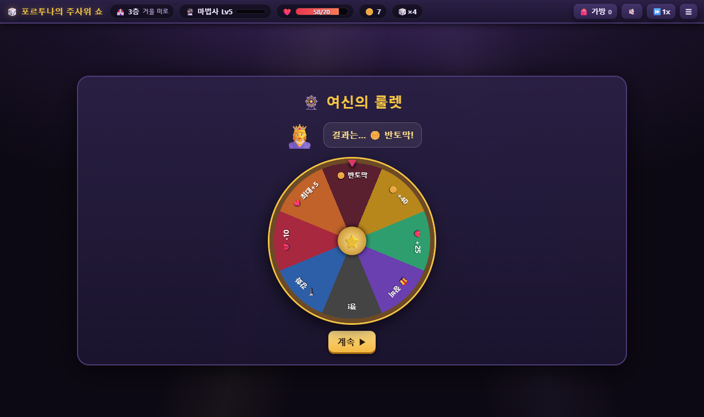

<div align="center">

# 🎲 포르투나의 주사위 쇼

### *Fortuna's Dice Show* — 변덕스러운 행운의 여신이 진행하는 던전 쇼

**HTML 파일 하나로 바로 실행되는 주사위 굴림 · 슬롯 배치 로그라이크 RPG**


</div>

---

## 📖 소개

당신은 행운의 여신 **포르투나**가 진행하는 던전 쇼에 초대받은 도전자입니다.
관객의 환호와 야유 속에서 주사위를 굴리고, 장비 슬롯에 끼워 넣고, 확률을 계산해 **6개 층의 무대**를 돌파하세요.
마지막 무대에서 기다리는 것은… 여신 본인입니다.

*Dicey Dungeons*, *Astrea: Six-Sided Oracles*처럼 **주사위 = 행동 자원**인 장르를 브라우저 하나로 즐길 수 있게 만들었습니다.
이미지·음원 같은 외부 에셋과 라이브러리, 빌드 과정이 전혀 없는 `index.html` 파일 하나입니다.

<div align="center">

<br><sub>전투 화면: 위쪽 빨간 주사위는 적의 예고(인텐트), 아래 초록 트레이가 내 주사위입니다</sub>
</div>

## 🚀 실행 방법

```bash
git clone https://github.com/jeiel85/fortuna-dice-show.git
```

`index.html`을 더블클릭해 브라우저로 열면 끝입니다. 설치할 것도 서버도 필요 없습니다.

> 💾 **진행 저장**은 `localStorage`를 씁니다. 일부 브라우저는 `file://`로 연 페이지의 저장소를 제한하므로, 저장이 되지 않으면 간단한 정적 서버로 여세요.
> ```bash
> python -m http.server 8000
> ```
> 그다음 `http://localhost:8000` 접속

## ✨ 주요 특징

| | |
|---|---|
| 🎲 **3D 주사위 물리 연출** | 쿼터니언 회전과 원근 투영으로 그린 입체 주사위가 트레이 벽과 서로 부딪히며 굴러간 뒤, 나온 눈으로 부드럽게 정착합니다 |
| 🖱️ **드래그 앤 드롭 / 클릭 배치** | 주사위를 장비 카드로 끌어다 놓거나, 클릭해 고른 뒤 장비를 클릭합니다. 넣을 수 있는 장비는 자동으로 강조됩니다 |
| 🗡️ **장비 52종 + 몬스터 기술 16종** | 무기 18 · 방어구 9 · 주문 12 · 도구 13. 조건은 `홀수`, `짝수`, `최대 N`, `최소 N`, `정확히 N`, `같은 눈 2개`, `카운트다운` 등 |
| 🔧 **주사위 변형 도구** | 눈 +1/−1/+2, 뒤집기(7−■), 분할, 합성, 복제, ×2, 재굴림, 50% 도박… 새로 생긴 주사위는 다시 연쇄에 쓸 수 있습니다 |
| ⬆️ **장비 강화(+)** | 조건 완화(`최소 5` → `최소 4`)나 효과 증가. 대장간·상점·이벤트에서 강화할 수 있습니다 |
| 👹 **적도 주사위를 굴린다** | 적이 매 턴 주사위를 굴려 자기 장비 슬롯에 배치하고, 그 예고를 보고 공격과 방어를 판단합니다 |
| 🗺️ **절차적 던전 6층** | 매 층 분기형 맵을 새로 생성합니다. 전투 · 엘리트 · 보물 상자 · 회복 사과 · 상점 · 대장간 · 여신의 이벤트 · 보스룸 |
| 🔊 **Web Audio 합성 효과음** | 주사위 달그락, 칼 휘두르기(휙), 방패 막기(챙-), 마법, 팡파르까지 모두 코드로 합성합니다 |
| 💾 **실시간 자동 저장** | 층, 장착 장비, 가방, 골드, 체력은 물론 **전투 중인 주사위와 적의 예고까지** 행동할 때마다 저장합니다 |
| 📱 **반응형** | 데스크톱과 모바일 세로 화면 모두 지원합니다. 모바일에서는 트레이가 하단에 고정됩니다 |

## 🧙 클래스

| 클래스 | 체력 | 고유 기술 | 플레이 스타일 |
|:---:|:---:|---|---|
| 🛡️ **전사** | 60 | **🔁 재굴림**: 턴마다 2회(Lv5부터 3회) 주사위를 다시 굴림 | 튼튼한 몸으로 버티며 마음에 안 드는 눈은 힘으로 바꾼다 |
| 🗡️ **도적** | 52 | **🫳 슬쩍하기**: 사용한 눈의 합이 10이 되면 충전. 적 장비를 훔쳐 이번 전투에서 쓰고, 그 장비의 예고도 취소 | 적의 무기로 적을 친다 |
| 🔮 **마법사** | 46 | **📖 스펠북**: 주문은 매 턴 2~3개만 펼쳐짐. 연속 시전 시 **연계 보너스** 누적, 페이지 넘기기로 교체 | 주문 연계로 한 턴에 몰아치는 폭발력 (장비 8칸) |
| 🎲 **도박사** | 44 | **🎰 올인**: 주사위 하나를 50% 확률로 6, 50% 확률로 1로. 패시브: 주사위 +1개 | 여신이 가장 아끼는 광대. 모든 것을 건다 |

<div align="center">

</div>

## 🎮 플레이 방법

1. **턴 시작**: 적이 먼저 주사위를 굴려 예고 슬롯에 배치하고, 이어서 내 주사위 3~5개가 굴러갑니다.
2. **주사위 배치**: 조건이 맞는 장비에 주사위를 넣으면 효과가 **즉시** 발동합니다.
   주사위 없이 장비만 클릭하면 들어갈 수 있는 가장 높은 주사위가 자동으로 들어갑니다.
3. **예고 읽기**: 적 카드 아래의 `⚔️7 🔥2` 같은 표시가 다음 적 턴의 행동입니다. 내 체력바 아래에 **예상 피해**가 나옵니다.
4. **턴 종료**: 남은 주사위는 사라지고, 적이 예고한 행동을 실행합니다.
5. **성장**: 승리하면 골드·경험치와 장비를 3개 중 1개 얻습니다. **레벨 3과 6에 주사위가 늘어납니다.**

<div align="center">

</div>

### ✨ 상태이상

| | 이름 | 효과 |
|:---:|---|---|
| 🔥 | 화상 | 다음 턴에 주사위 N개가 불타고, 사용할 때마다 체력 2 손실 |
| ❄️ | 빙결 | 다음 턴에 가장 높은 주사위 N개가 1이 됨. **적에게 걸면 예고된 주사위가 즉시 1이 되어 조건이 깨지면 행동이 무산됨** |
| ⚡ | 감전 | 다음 턴에 장비 N개 봉인. **적에게 걸면 예고 행동 즉시 취소** |
| 🧪 | 독 | 턴 시작 시 N 피해(방어 무시) 후 1 감소 |
| 💧 | 약화 | 다음 턴 동안 공격 피해 절반 |
| 💪 | 힘 | 전투 동안 공격 피해 +N |
| 🌵 | 가시 | 공격받을 때마다 공격자에게 N 피해 |
| 💨 | 회피 | 다음 공격 1회 무효화 |

### 🏰 여섯 개의 무대

| 층 | 무대 | 보스 |
|:---:|---|---|
| 1 | 대기실 | 🃏 딜러 고블린 |
| 2 | 카지노 홀 | 🎰 슬롯머신 골렘 |
| 3 | 거울 미로 | 🎡 룰렛의 망령 |
| 4 | 용광로 무대 | 🎲 쌍둥이 주사위 악마 |
| 5 | 저주받은 객석 | ⌛ 시간의 사신 |
| 6 | 여신의 무대 | 👸 **행운의 여신 포르투나** |

일반 몬스터 24종, 엘리트 6종, 보스 6종이 나옵니다. 보스는 체력이 절반 이하로 떨어지면 분노합니다.

<div align="center">

<br><sub>여신의 이벤트: 룰렛 · 주사위 대결 · 여신의 거래</sub>
</div>

### ⌨️ 단축키

| 키 | 동작 |
|:---:|---|
| `1` ~ `9` | 주사위 선택 |
| `E` / `Enter` | 턴 종료 |
| `R` | 클래스 스킬 |
| `Esc` | 선택 취소 / 창 닫기 |

상단 바에서 사운드를 켜고 끌 수 있고, 연출 속도는 1x·2x·3x 중에서 고를 수 있습니다.

## 🛠️ 기술 메모

- **단일 파일**: HTML, CSS, JS가 `index.html` 하나에 들어 있습니다. 외부 스크립트, 폰트, 이미지, 오디오가 없습니다.
- **3D 주사위**: 정육면체 6면을 쿼터니언으로 회전시키고 원근 투영해 Canvas 2D로 그립니다. 굴림이 끝나면 목표 눈의 면이 정면을 향하도록 `slerp`로 정착시킵니다. 마주보는 면의 합은 7입니다.
- **트레이 물리**: 속도 감쇠, 벽 반사, 주사위끼리의 원형 충돌. 충돌 강도에 맞춰 달그락 소리가 납니다.
- **적 AI**: 굴린 주사위를 조건이 까다로운 장비부터 백트래킹으로 채워 예고를 만듭니다.
- **효과 미리보기**: 장비 효과 함수를 기록 전용 컨텍스트로 실행해 적 예고와 예상 피해를 계산합니다.
- **저장**: 게임 상태 전체가 JSON 직렬화 가능한 순수 데이터라서, 행동할 때마다 `localStorage`에 기록하고 전투 도중 새로고침해도 같은 주사위, 같은 예고 상태로 이어집니다.
- **밸런스 점검**: 브라우저에서 탐욕 알고리즘 자동 플레이 봇으로 4개 클래스를 반복 플레이하며 보스 체력과 적 구성을 조정했습니다.

## 📂 구조

```
fortuna-dice-show/
├── index.html   # 게임 전체 (약 1,800줄)
├── docs/        # README 스크린샷
└── README.md
```

---

<div align="center">

*"주사위는 던져졌어요. 즐겁게 해 주세요~"* — 포르투나

</div>
